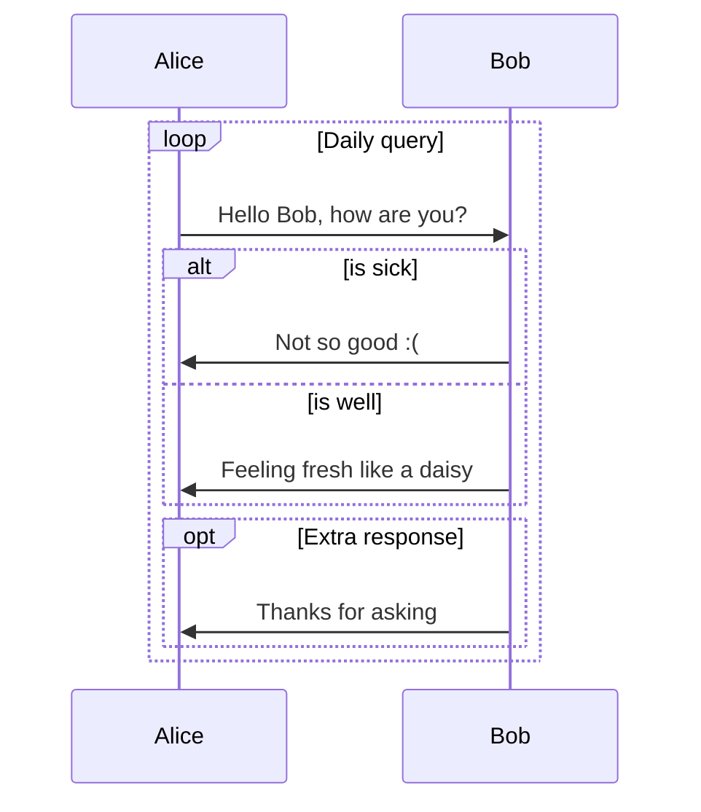
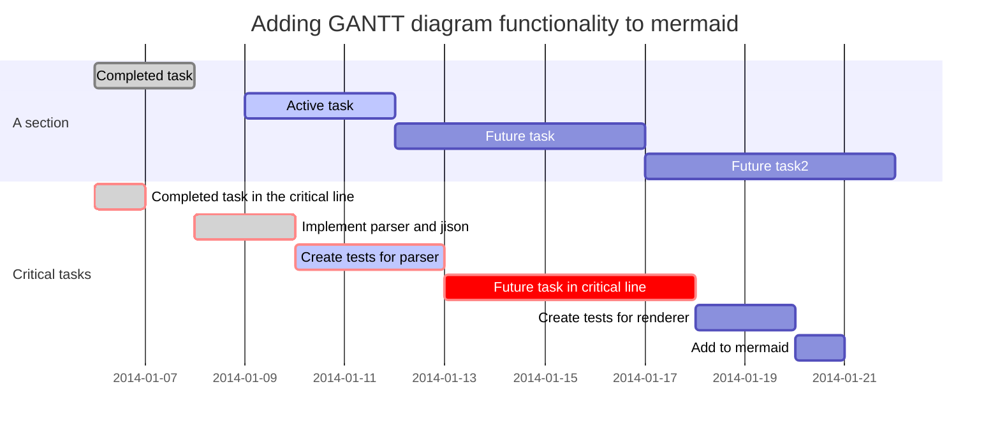

# MindForger User Documentation <!-- Metadata: type: Outline; tags: basics; created: 2018-03-17 17:50:10; reads: 485; read: 2018-05-31 23:10:38; revision: 485; modified: 2018-05-31 23:10:38; importance: 0/5; urgency: 0/5; -->

Table of contents:

* [CLI and man](#cli-and-man)
* [Repository](#repository)
* [Configuration](#configuration)
* [Markdown IDE](#markdown-ide)
* [Searching](#searching)
* [Thinking Notebook](#thinking-notebook)
* [Sharing](#sharing)
* [Cheatsheet: Keyboard Shortcuts](#keyboard-shortcuts)

This document _briefly_ describes key MindForger features.
# CLI and man <!-- Metadata: type: Note; created: 2018-05-01 17:26:17; reads: 31; read: 2018-05-29 22:46:55; revision: 10; modified: 2018-05-29 22:46:55; -->
Read MindForger  manual page for command line options documentation:

```shell
man mindforger
```
Check also help:

```shell
$ mindforger --help

Usage: mindforger [options] [<directory>|<file>]
Thinking notebook.

Options:
  -t, --theme <theme>            Use 'dark', 'light' or other GUI <theme>.
  -c, --config-file-path <file>  Load configuration from given <file>.
  -v, --version                  Displays version information.
  -h, --help                     Displays this help.

Arguments:
  [<directory>|<file>]           MindForger repository or directory/file with
                                 Markdown(s) to open
```
# Repository <!-- Metadata: type: Note; created: 2018-04-10 10:50:50; reads: 32; read: 2018-05-29 22:59:20; revision: 12; modified: 2018-05-29 22:59:20; -->
MindForger can be used to:

* manage knowledge in a [MindForger repository](#mindforger-repository)
* edit single [Markdown file](#markdown-file)
* edit [multiple Markdown files](#markdown-directory) in given (sub)directories
## MindForger repository <!-- Metadata: type: Note; created: 2018-04-10 10:51:20; reads: 37; read: 2018-05-30 06:45:13; revision: 13; modified: 2018-05-30 06:45:13; -->
MindForger repository is a directory with specific 
[structure](developer-documentation.md#repository-layout) 
where MindForger stores your **knowledge**. It contains Markdown 
files ([Markdown hosted DSL](developer-documentation.md#markdown-hosted-dsl)) 
allowing you to get most of MindForger capabilities.

If you run MindForger without parameters, then it opens
default MindForger repository:

```
$ mindforger
```

If MindForger default repository doesn't exist, then it is created
on MindForger first start in:

```
~/mindforger-repository
```

Repository structure looks like this:

```
$ tree mindforger-repository/

mindforger-repository/
├── limbo
├── memory
├── mind
└── stencils
    ├── notebooks
    └── notes
```
## Markdown file <!-- Metadata: type: Note; created: 2018-04-10 10:50:58; reads: 29; read: 2018-05-29 22:55:11; revision: 5; modified: 2018-05-29 22:55:11; -->
MindForger can be used to edit **single** Markdown file:

```
mindforger analysis.md
```

If given file exists, then it's opened for edit, else
new Markdown file with this name is **created** and opened.
## Markdown directory <!-- Metadata: type: Note; created: 2018-04-10 10:51:14; reads: 19; read: 2018-05-31 23:03:27; revision: 5; modified: 2018-05-31 23:03:27; -->
You can open **any** directory and MindForger will find
all Markdown files within the directory and its sub-directories
and open them for search, navigation and editation:

```
$ mindforger a-github-repository-with-interesting-content
```

For example, you can find an [interesting Git repository](#markdown-content-and-examples)
on GitHub or BitBucket, clone it to your machine and open it 
with MindForger to easily find and navigate it.
# Configuration <!-- Metadata: type: Note; created: 2018-04-30 14:19:30; reads: 43; read: 2018-05-31 23:04:40; revision: 8; modified: 2018-05-31 23:04:40; -->
MindForger can be configured either from UI:

* menu `Mind/Adapt`

... or by editation of its configuration file (while MindForger is **NOT** running):

* `~/.mindforger.md`

Check `.mindforger.md` for configuration options details and description.
# Markdown IDE <!-- Metadata: type: Note; created: 2018-04-26 08:47:53; reads: 23; read: 2018-05-31 23:05:50; revision: 3; modified: 2018-05-31 23:05:50; -->
This section provides brief overview of MindForger's 
Markdown editor and Markdown IDE features.
## Markdown editor <!-- Metadata: type: Note; tags: todo; created: 2018-04-10 10:52:02; reads: 38; read: 2018-05-31 23:06:24; revision: 7; modified: 2018-05-31 23:06:24; -->
...

side-by-side editor and MF

...
### View vs Edit mode <!-- Metadata: type: Note; tags: important; created: 2018-05-31 23:09:05; reads: 10; read: 2018-05-31 23:09:08; revision: 2; modified: 2018-05-31 23:09:08; -->
...
### Markdown <!-- Metadata: type: Note; created: 2018-03-17 17:50:10; reads: 41; read: 2018-05-04 06:39:09; revision: 10; modified: 2018-05-04 06:39:09; -->
[Markdown](https://daringfireball.net/projects/markdown/) is  a plain text formatting syntax introduced by John Gruber.
Markdown allows you to write using an easy-to-read, easy-to-write plain text 
format to get rendered HTML.

MindForger uses Markdown-based DSL as format of your remarkks. For Markdown
syntax documentation please refere to:

* [John Gruber Markdown syntax](https://daringfireball.net/projects/markdown/syntax) documentation
* [GitHub Markdown](https://help.github.com/articles/basic-writing-and-formatting-syntax/) documentation
* [GitHub flawored Markdown](https://github.github.com/gfm/) specification
* [Discount](https://www.pell.portland.or.us/~orc/Code/discount/) documentation
* [Mermaid diagrams](https://mermaidjs.github.io/) documentation
#### Text <!-- Metadata: type: Note; created: 2018-04-15 18:26:48; reads: 40; read: 2018-04-26 08:49:01; revision: 7; modified: 2018-04-26 08:49:01; -->
`Monospace` text, *emph* text, **bold** text, 
_italic_ text, __bold__ text, ~~deleted~~ text.

#### Keyboard keys <!-- Metadata: type: Note; created: 2018-05-03 10:07:40; reads: 12; read: 2018-05-03 10:08:27; revision: 4; modified: 2018-05-03 10:08:27; -->
You can use <kbd>Alt+f b</kbd> to make marked text bold.
#### Images <!-- Metadata: type: Note; created: 2018-04-26 08:45:45; reads: 35; read: 2018-05-31 23:07:43; revision: 13; modified: 2018-05-31 23:07:43; -->
See Markdown source of this Note to learn **image** syntax.

Image from web:


Image from current MindForger repository:


---

💡 click menu `Format/Image` or press <kbd>Alt+f m</kbd> to insert image.
#### Links <!-- Metadata: type: Note; created: 2018-04-26 08:46:02; reads: 58; read: 2018-05-31 23:07:56; revision: 23; modified: 2018-05-31 23:07:56; -->
See Markdown source of this Note to learn **link** syntax.

Link to web:

* [MindForger home page](http://www.mindforger.com)

Automatic web link:

* https://github.com/dvorka/mindforger

Link to a Notebook in active MindForger repository:

* [MF history](./history.md)

Link to a Note in active MindForger repository:

* [MF motivation](./why-mindforger.md#motivation)

Link to a file on the filesystem:

* [.bashrc](/etc/bash.bashrc)

Link to a directory on the filesystem:

* [/tmp](/tmp)

---

💡 click menu `Format/Link` or press <kbd>Alt+f l</kbd> to insert link.
#### Smarty pants <!-- Metadata: type: Note; created: 2018-04-15 18:26:48; reads: 42; read: 2018-04-26 08:49:05; revision: 6; modified: 2018-04-26 08:49:05; -->

[Smarty pants like](https://daringfireball.net/projects/smartypants/) like:

* curly " and '
* ``backsticks''
* dashes a--ha and a---ha
* (tm) and (r) and (c)
* consecutive dots ...
* 1/4 1/2
* A^B and a^(b+2)
#### HR <!-- Metadata: type: Note; created: 2018-04-15 18:26:48; reads: 46; read: 2018-05-04 06:45:10; revision: 8; modified: 2018-05-04 06:45:10; -->
Horizontal...

---
... rulers ...

***
... split screen horizontally.
___

#### List <!-- Metadata: type: Note; created: 2018-04-15 18:26:48; reads: 43; read: 2018-05-04 06:46:14; revision: 7; modified: 2018-05-04 06:46:14; -->
Bullet list:

* why
    * ?
- how
    * !
+ what
    * .

Numbered list:

1. why
    1. ?
2. how
    1. ?
3. what
    1. ?

#### Tasks <!-- Metadata: type: Note; created: 2018-04-15 18:26:48; reads: 55; read: 2018-04-30 08:09:49; revision: 10; modified: 2018-04-30 08:09:49; -->
Task list:

* [x] skip-gram
* [ ] bag of words
* [X] GloWe vs. word2vec
* [ ] word embedding
* [x] stemmer

#### Blockquote <!-- Metadata: type: Note; created: 2018-04-15 18:26:48; reads: 37; read: 2018-05-04 06:48:37; revision: 7; modified: 2018-05-04 06:48:37; -->
Riddle:

> frodo and
> glum,
>> riddles
>>> in the dark

#### Tables <!-- Metadata: type: Note; created: 2018-04-15 18:26:48; reads: 45; read: 2018-05-04 06:46:57; revision: 7; modified: 2018-05-04 06:46:57; -->
Pets:

Snake | Turtle
----- | ------
Karkulka | Ema

Frontend | Backend
:----- | :------
Qt | C++
#### Source code with syntax highlighting <!-- Metadata: type: Note; created: 2018-04-15 18:26:48; reads: 36; read: 2018-05-04 06:49:52; revision: 6; modified: 2018-05-04 06:49:52; -->
There are multiple options how a block of source code can be written in Markdown.

**IMPORTANT**: note leading empty lines before code blocks.

---

1) Tab indentation w/o language spec and w/o syntax highlighting:

	public static void main(string[] args) {
    	return 0;
	}

---

2) Code block w/ language spec:

```java
public static void main(string[] args) {
    return 0;
}
```

or w/o language spec:

```
public static void main(string[] args) {
    return 0;
}
```

---

3) Fenced block w/ language spec:

~~~java
public static void main(string[] args) {
    return 0;
}
~~~

or w/o language spec:

~~~
public static void main(string[] args) {
    return 0;
}
~~~
#### Math <!-- Metadata: type: Note; created: 2018-04-15 18:26:48; reads: 42; read: 2018-04-26 08:49:09; revision: 7; modified: 2018-04-26 08:49:09; -->
[MathJax](https://www.mathjax.org/) handles **inline** expressions like: x^2 + y^2 = z^2 or **block** expressions like: $$\frac{D\rho}{Dt} = 0.$$


Check MathJax documentation and/or [cheatsheet](https://math.meta.stackexchange.com/questions/5020/mathjax-basic-tutorial-and-quick-reference) for more examples.

Quadratic equation root: When \(a \ne 0\), there are two solutions to \(ax^2 + bx + c = 0\) and they are
$$x = {-b \pm \sqrt{b^2-4ac} \over 2a}.$$

Sum:
$$\sum_{i=0}^n i^2 = \frac{(n^2+n)(2n+1)}{6}$$

Limit:
$$\lim_{x\to 0}$$

Sqrt:
$$\left(\frac{\sqrt x}{y^3}\right)$$
#### Diagrams <!-- Metadata: type: Note; created: 2018-04-15 18:26:48; reads: 47; read: 2018-04-26 08:49:10; revision: 7; modified: 2018-04-26 08:49:10; -->
Flowchart diagram:


Sequence diagram:



GANTT diagram:



#### Comments <!-- Metadata: type: Note; created: 2018-05-04 06:48:59; reads: 18; read: 2018-05-04 06:49:36; revision: 2; modified: 2018-05-04 06:49:36; -->
Markdown comments:

[/]:# (This is a comment, you cannot see it)

And HTML comments:

<!-- (usually) also invisible -->
#### Drag & Drop Images and Files <!-- Metadata: type: Note; tags: todo; created: 2018-05-25 07:19:26; reads: 11; read: 2018-05-31 23:07:01; revision: 3; modified: 2018-05-31 23:07:01; -->
_This feature is not implemented yet._
### Editor syntax highlighting <!-- Metadata: type: Note; created: 2018-04-26 08:49:22; reads: 17; read: 2018-05-31 23:08:38; revision: 7; modified: 2018-05-31 23:08:38; -->
Markdown text below demonstrates syntax highlighting
capabilities in **edit** mode - <kbd>double click</kbd> HTML preview to open
Markdown editor:

---

*blah* text
*bl ah* text
*bl   ah* text
text *123* a text
*b123c* text
*1abc2* text

**blah** a text
text **blah**
text **bl ah** text
**bl   ah** text
 
_italic_
_ita lic_ text
text __italicer__
text __italicer__ text
text __ital icer__ text

~~strike~~ text
text ~~str ike~~
text ~~strike~~ text

`codeblock`
`codeb lock`
inlined `codeblock` inline

[Named Link](http://www.google.en/this-is-link) text

text http://www.autolink.com/ text
  http://www.autolink.com/ text
  http://www.autolink.com
text https://me.mf.com/info.html text
text https://me.mf.com/b/c/info.html text
Autolink in http://www.info.com/a/b text

[In: Introduction](#S-introduction) text

 text

* Bullet *and* his **with** list _italic_ and `code` is nice
    * Nested bullet
        * Sub-nested bullet etc
+ Also bullet
    + deep
- Event this bullet
    - deeper

1. A numbered list **with** list _italic_ and `code` is nice
    1. A nested numbered list
        3. Which is numbered

- [ ] An uncompleted task
- [x] A completed task

```
code block
```

```java
java code block
```

This is &entity;

<tag a="abc" b="123">nice</tag> text

---
## Markdown IDE <!-- Metadata: type: Note; created: 2018-04-10 10:52:12; reads: 33; read: 2018-05-04 06:58:52; revision: 3; modified: 2018-05-04 06:58:52; -->
MindForger is integrated development environment (IDE) for the development of Markdown
document collections (repositories, documentation, books, etc.):

* **multiple** Markdown documents can be opened in order to perform search, refactoring
  and analytics
* user defined **stencils** can be used to quickly create new notebooks and notes
* notebook **structure** can be easily refactored with outliner-style operations
  defined on notes
* notes can be **refactoried** withing or across different notebooks
### Multiple documents <!-- Metadata: type: Note; created: 2018-04-24 14:01:18; reads: 21; read: 2018-04-26 09:14:41; revision: 2; modified: 2018-04-26 09:14:41; -->
...
### Stencils <!-- Metadata: type: Note; created: 2018-04-24 14:01:55; reads: 25; read: 2018-05-30 06:47:44; revision: 18; modified: 2018-05-30 06:47:44; -->
Stencil represents a common pattern that can be used in
variations e.g., to solve a task. It might be a how to 
(like how to change a car wheel) that once created, you 
may want it to customize for a different case.

Notebook stencil corresponds to application of 
a problem/semantic domain to another problem. 
Once you have a _modus operandi_ or you know how to 
do that, than this is the case.

You can use a stencil when creating a **new** notebook
or note - check `Stencils` drop-down in the dialog
opened using menu `Notebook/New` or `Note/New`.

[MindForger repositories](#mindforger-repository) (including 
the default one) contain stencils for both notebooks and notes:

```
<mindforger repository>/
├── ...
└── stencils
    ├── notebooks
    └── notes
```

MindForger is shipped with an initial set of stencils for meeting
notes, software analysis/design, [GROW model](https://en.wikipedia.org/wiki/GROW_model)
etc. 

You can easily **extend** outlines just by copying Markdown file
to `notes` or `notebooks` directory.
### Notebook structure refactoring <!-- Metadata: type: Note; created: 2018-04-10 10:52:55; reads: 35; read: 2018-05-04 06:59:08; revision: 4; modified: 2018-05-04 06:59:08; -->
... Note up/down/...
### Note refactoring <!-- Metadata: type: Note; created: 2018-04-10 10:52:22; reads: 26; read: 2018-04-26 09:14:44; revision: 4; modified: 2018-04-26 09:14:44; -->
...
# Searching <!-- Metadata: type: Note; created: 2018-04-10 10:55:15; reads: 23; read: 2018-04-10 10:55:15; revision: 1; modified: 2018-04-10 10:55:15; -->
...
## Scope <!-- Metadata: type: Note; created: 2018-04-10 10:55:49; reads: 15; read: 2018-04-10 10:55:49; revision: 1; modified: 2018-04-10 10:55:49; -->
...
## Fulltext <!-- Metadata: type: Note; created: 2018-04-10 10:55:44; reads: 13; read: 2018-04-10 10:55:46; revision: 2; modified: 2018-04-10 10:55:46; -->
...
## Name <!-- Metadata: type: Note; created: 2018-04-10 10:55:57; reads: 11; read: 2018-04-10 10:55:57; revision: 1; modified: 2018-04-10 10:55:57; -->
...
## Tag <!-- Metadata: type: Note; created: 2018-04-10 10:56:02; reads: 9; read: 2018-04-10 10:56:02; revision: 1; modified: 2018-04-10 10:56:02; -->
...
# Thinking Notebook <!-- Metadata: type: Note; created: 2018-04-10 10:50:28; reads: 51; read: 2018-04-26 08:48:05; revision: 5; modified: 2018-04-26 08:48:05; -->
...
## Think as you Search <!-- Metadata: type: Note; created: 2018-04-10 10:49:58; reads: 27; read: 2018-04-10 10:50:31; revision: 2; modified: 2018-04-10 10:50:31; -->
...
## Think as you Read <!-- Metadata: type: Note; created: 2018-04-10 10:50:11; reads: 23; read: 2018-04-10 10:50:31; revision: 2; modified: 2018-04-10 10:50:31; -->
...
## Think as you Write <!-- Metadata: type: Note; created: 2018-04-10 10:50:18; reads: 19; read: 2018-04-10 10:50:32; revision: 2; modified: 2018-04-10 10:50:32; -->
...
## Forgetting <!-- Metadata: type: Note; created: 2018-04-10 10:54:02; reads: 24; read: 2018-05-03 09:26:24; revision: 17; modified: 2018-05-03 09:26:24; -->
> Motto: "Computers need to forget". -- [Viktor Mayer-Schönberger](http://blog.mindforger.com/2007/11/computers-need-to-forget.html)

Before I deep dive to MindForger features let me formulate
a few questions to explain the motivation behind 
forgetting/scoping related functionality:

* Do we forget or we simply don’t remember?
* When we forget?
* How and where exactly forgetting in our minds happens?
* If we remember something, can it be forgotten?
* Do we need to forget and why?

I believe that if a concept makes it to long term memory
(LTM), then it can be never forgotten. It’s in LTM and 
it always be there. The only question is how many 
association/links it has. In the worst case it may happen 
that there is no association path it it - it ends as an
island or orphan better said. If it’s not reminded or not 
used for long time, association can get weaker and weaker 
and such concepts is diving deeper and deeper to LTM. However,
it is always there. Thus it’s just about the lookup. 
According to my experience a strong emotional experience or 
return to the deeper paths of LTM (talking about your friends 
or family about your early childhood) helps to remind such
concepts and in the latter case even strongly bind them 
to upper level LTM (move them up in the memory) and 
refresh such memories so that you can remind them later 
much more easier.

If there would be no possibility of the selection of sensed
informations and all the sensing will be fixed in our 
memory, its capacity would be fully used very soon.

MindForger, as computer program, needs to forget. But
forgetting does **NOT** mean deleting of information.

MindForger maintains **all** the remarks you ever written
(see [limbo](#limbo)), but works with/shows only with 
a [scope](#time-scope) **configurable** by you.
### Time scope <!-- Metadata: type: Note; created: 2018-04-10 10:54:24; reads: 47; read: 2018-05-03 10:08:38; revision: 43; modified: 2018-05-03 10:08:38; -->
Use menu `Mind/Scope` or <kbd>Alt+m p</kbd> to configure time scope.

---

Consider the following situations:

* Over the years your employer company internal systems change and/or
  you work for a number of different employers. Each time there is 
  a different/better/stronger 
  Wifi authentication configuration (video conference
  setup, payslips system, etc.). Therefore in you memory (or in MindForger
  remarks) there are **multiple** how-tos, but you want to use
  only the **recent** want. At the same time you do not want to
  (explicitly) remove/purge the previous how-tos as they can be useful in different
  situations.

* You learn how to manually divide two long numbers as a child.
  Then you do **not** need this skill **for years** as you use calculator/computer.
  When you want to learn your child how to manually divide numbers,
  you have to find it (deep) in your memory.

This is where MindForger **time scope** functionality comes in - you can 
restrict the scope (notes working set) by **time**. For example:

* you work on a project and want to see only notes you modified **today**
* whenever you use MindForger you want to work with notes not older
  than **18 months**
* when reading/working with your employer internal systems how-to **notebook** you want to
  see only notes younger than **1 year**

In particular you can set **global** time scope:

* Notebooks listing: 
    * Only **noteboks** within given time scope (younger) will be shown.
* Add/forget notebook:
    * Notebooks can be added/forgotten.
* Notebook's note tree view: 
    * Only notes within given time scope will be shown.
      If note **is** within timescope and note's parent notes are **not**, then note **is**
      shown along with its parents (parents would be normally hidden). In other words, fresh note
      ensures its parents are shown.
* Add/remove note: 
    * Notes can be added/forgotten.
    * **IMPORTANT**: remember that note can be forgotten **along with its child notes** that can be
      hidden (if they didn't match time scope) i.e. you may delete notes you don't see.
* Promote/demote/up/down note:
    * Notes can be added/forgotten.
    * **IMPORTANT**: remember that these operations work on the **non-filtered* model i.e.
      you perform operation (e.g. up), nothing seems to happen, but the note was just moved above
      a hiddin note that is not in scope i.e. you refactor notes you don't see.
* Note refactoring:
    * Notes can be refactoring (to other notebook) and extracted.
    * **IMPORTANT**: remember that note can be refactored **along with its child notes** that can be
      hidden (if they didn't match time scope) i.e. you may move notes you don't see.
     
In particular you can set **note** specific time scope that overrides global time scope:

* ... behaviour is the same as above except that this setting has no effect on notebooks listing ...
### Limbo <!-- Metadata: type: Note; created: 2018-04-10 10:56:16; reads: 16; read: 2018-05-03 10:06:46; revision: 4; modified: 2018-05-03 10:06:46; -->
MindForger does **not** **delete** notebooks - it moves them to a location called Limbo that
can be found in `${ACTIVE_MF_REPOSITORY}/limbo`. This is where you can delete Markdown
documents pernamently.

MindForger, in its current implementation, **does** delete notes. They are not moved to a note Limbo.
If you use menu `Note/Forget`, then the note is deleted. 

Side note: I personally use CMS (Git) - I have full history of notebooks and notes. Tracking of
all notes would be usefull, however HW resource consumption intensive. This is also
why I don't want to duplicate this (already sophisticated) functionality within MindForger.
# Sharing <!-- Metadata: type: Note; created: 2018-04-10 10:59:54; reads: 9; read: 2018-04-10 10:59:56; revision: 2; modified: 2018-04-10 10:59:56; -->
...
# Cheatsheets <!-- Metadata: type: Note; created: 2018-04-10 10:53:18; reads: 13; read: 2018-05-31 23:10:38; revision: 2; modified: 2018-05-31 23:10:38; -->
See MindForger cheetsheet(s):

* [Keyboard Shortcuts](#keyboard-shortcuts)
## Keyboard Shortcuts <!-- Metadata: type: Note; created: 2018-03-17 17:50:10; reads: 35; read: 2018-05-04 06:59:51; revision: 12; modified: 2018-05-04 06:59:51; -->
Prefer menu based keyboard shortcuts which are self-documented e.g.

* <kbd>Alt+o n</kbd>       
    * create new notebook
* <kbd>Alt+o e</kbd>       
    * edit currently viewed notebook
* <kbd>Alt+n n</kbd>       
    * create new note
* <kbd>Alt+n e</kbd>       
    * edit currently viewed note
* ... and many others...


Editor:

* <kbd>Alt+Left</kbd>
    * ... save Note, leave editor and show rendered HTML.
* <kbd>Ctrl+g</kbd>
    * ... cancel editation and leave editor without saving

Views:

* <kbd>Ctrl+Shift+o</kbd>
    * ... Recall n**o**tebook.
* <kbd>Ctrl+Shift+n</kbd> 
    * ... Recall **n**ote.
