# MindForger User Documentation <!-- Metadata: type: Outline; tags: basics; created: 2018-03-17 17:50:10; reads: 982; read: 2018-07-11 16:28:46; revision: 982; modified: 2018-07-11 16:28:46; importance: 2/5; urgency: 5/5; -->

Table of contents:

* [CLI and man](#cli-and-man)
* [Repository](#repository)
* [Configuration](#configuration)
* [Markdown IDE](#markdown-ide)
* [Searching](#searching)
* [Thinking Notebook](#thinking-notebook)
* [Cheatsheet: Keyboard Shortcuts](#keyboard-shortcuts)

This document _briefly_ describes key MindForger features.
# CLI and man <!-- Metadata: type: Note; created: 2018-05-01 17:26:17; reads: 35; read: 2018-05-29 22:46:55; revision: 10; modified: 2018-05-29 22:46:55; -->
Read MindForger  manual page for command line options documentation:

```shell
man mindforger
```
Check also help:

```shell
$ mindforger --help

Usage: mindforger [options] [<directory>|<file>]
Thinking notebook.

Options:
  -t, --theme <theme>            Use 'dark', 'light' or other GUI <theme>.
  -c, --config-file-path <file>  Load configuration from given <file>.
  -v, --version                  Displays version information.
  -h, --help                     Displays this help.

Arguments:
  [<directory>|<file>]           MindForger repository or directory/file with
                                 Markdown(s) to open
```
# Repository <!-- Metadata: type: Note; created: 2018-04-10 10:50:50; reads: 36; read: 2018-05-29 22:59:20; revision: 12; modified: 2018-05-29 22:59:20; -->
MindForger can be used to:

* manage knowledge in a [MindForger repository](#mindforger-repository)
* edit single [Markdown file](#markdown-file)
* edit [multiple Markdown files](#markdown-directory) in given (sub)directories
## MindForger repository <!-- Metadata: type: Note; created: 2018-04-10 10:51:20; reads: 45; read: 2018-05-30 06:45:13; revision: 13; modified: 2018-05-30 06:45:13; -->
MindForger repository is a directory with specific 
[structure](developer-documentation.md#repository-layout) 
where MindForger stores your **knowledge**. It contains Markdown 
files ([Markdown hosted DSL](developer-documentation.md#markdown-hosted-dsl)) 
allowing you to get most of MindForger capabilities.

If you run MindForger without parameters, then it opens
default MindForger repository:

```
$ mindforger
```

If MindForger default repository doesn't exist, then it is created
on MindForger first start in:

```
~/mindforger-repository
```

Repository structure looks like this:

```
$ tree mindforger-repository/

mindforger-repository/
├── limbo
├── memory
├── mind
└── stencils
    ├── notebooks
    └── notes
```
## Markdown file <!-- Metadata: type: Note; created: 2018-04-10 10:50:58; reads: 33; read: 2018-05-29 22:55:11; revision: 5; modified: 2018-05-29 22:55:11; -->
MindForger can be used to edit **single** Markdown file:

```
mindforger analysis.md
```

If given file exists, then it's opened for edit, else
new Markdown file with this name is **created** and opened.
## Markdown directory <!-- Metadata: type: Note; created: 2018-04-10 10:51:14; reads: 26; read: 2018-06-09 23:03:27; revision: 5; modified: 2018-06-09 23:03:27; -->
You can open **any** directory and MindForger will find
all Markdown files within the directory and its sub-directories
and open them for search, navigation and editation:

```
$ mindforger a-github-repository-with-interesting-content
```

For example, you can find an [interesting Git repository](#markdown-content-and-examples)
on GitHub or BitBucket, clone it to your machine and open it 
with MindForger to easily find and navigate it.
# Configuration <!-- Metadata: type: Note; created: 2018-04-30 14:19:30; reads: 48; read: 2018-07-10 07:18:22; revision: 10; modified: 2018-07-10 07:18:22; -->
MindForger can be configured either from UI:

* menu `Mind/Adapt`

... or using configuration file (while MindForger is **NOT** running):

* `~/.mindforger.md`

Check `.mindforger.md` for configuration options details and description.
# Markdown IDE <!-- Metadata: type: Note; created: 2018-04-26 08:47:53; reads: 25; read: 2018-06-09 23:05:50; revision: 3; modified: 2018-06-09 23:05:50; -->
This section provides brief overview of MindForger's 
Markdown editor and Markdown IDE features.
## Markdown editor <!-- Metadata: type: Note; created: 2018-04-10 10:52:02; reads: 91; read: 2018-07-10 07:22:52; revision: 27; modified: 2018-07-10 07:22:52; -->
MindForger can be used as a Markdown **editor**.

It allows you to easily write [Markdown](#markdown) 
documents without the need to remember all the details 
of its **syntax** and **preview** Markdown rendered to 
HTML.

MindForger terminology:

* Markdown file is **Notebook**.
* Markdown document section (line with leading `#`) is **Note**.


MindForger represents any Markdown as [follows](#markdown-outline)...
### Markdown Outline <!-- Metadata: type: Note; created: 2018-05-30 07:03:16; reads: 46; read: 2018-07-10 07:25:11; revision: 22; modified: 2018-07-10 07:25:11; -->
In order to enable quick **navigation** and **refactoring** 
of Markdown documents, MindForger shows Markdown documents 
as an **outline** of Markdown sections (**Notes**) allowing
you to efficiently choose/read/edit/refactor particular section.


Check side-by-side Markdown document **text view**
and **MindForger view** in the image above:

* Markdown document named `INSTALLATION` is opened in a text editor (Emacs) on the **left**.
* The same Markdown document is opened in MindForger on the **right**.

As you can see, MindForger represents the hierarchy of sections 
(prefixed/underlined in Markdown syntax with/by `#`, `-` or `=`) 
as a **tree** - it's called **outline**:

* Tree of sections (on the left in MindForger window) reflects 
  the **depth/level** of individual sections e.g. section `UBUNTU` 
  on the second level is prefixed with `##` and shown on the second 
  level in the tree.

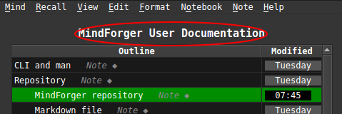

* You can **open** Markdown document **title section** (`INSTALLATION`) by
  clicking its name `INSTALLATION` above **outline**.
* Any **sub-section** can be opened by clicking its name in the tree.

For switching between section (pre)view and edit mode refer to the [next section](#view-vs-edit-mode).

### View vs Edit mode <!-- Metadata: type: Note; tags: important; created: 2018-05-30 07:03:50; reads: 43; read: 2018-07-10 08:51:38; revision: 13; modified: 2018-07-10 08:51:38; -->
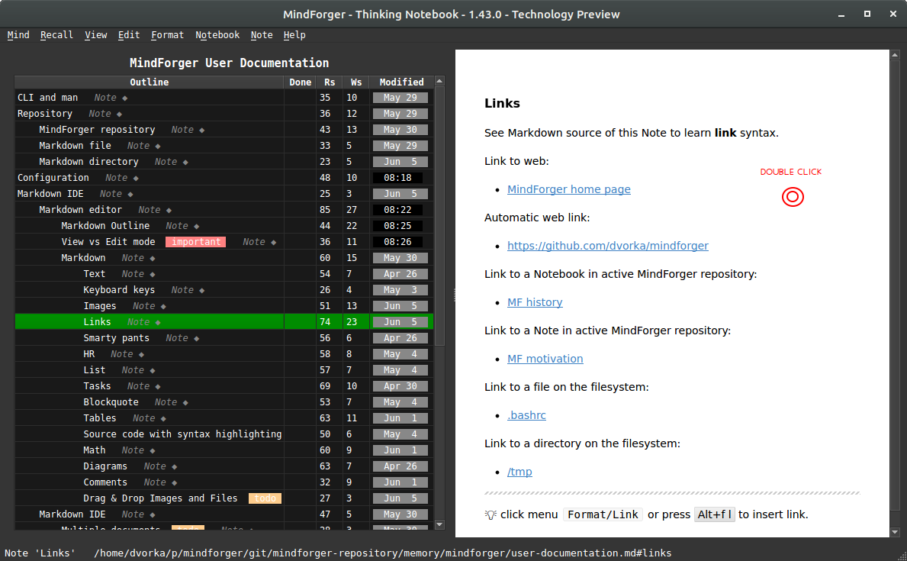

If you want to **edit** a section either **double-click** anywhere in the 
rendered preview on the right (in the MindForger window) or choose:

*  menu `Notebook/Edit` for title section
*  menu `Note/Edit` for any sub-section
### Markdown <!-- Metadata: type: Note; created: 2018-03-17 17:50:10; reads: 64; read: 2018-05-30 07:30:17; revision: 15; modified: 2018-05-30 07:30:17; -->
[Markdown](https://daringfireball.net/projects/markdown/) is  a plain text formatting syntax introduced by John Gruber.
Markdown allows you to write using an easy-to-read, easy-to-write plain text 
format to get rendered HTML.

MindForger uses Markdown-based DSL as format of 
your remarks. There exist many Markdown flavors - for
Markdown syntax documentation please refere to:

* [John Gruber Markdown syntax](https://daringfireball.net/projects/markdown/syntax) documentation
* [GitHub Markdown](https://help.github.com/articles/basic-writing-and-formatting-syntax/) documentation
* [GitHub flawored Markdown](https://github.github.com/gfm/) specification
* [Discount](https://www.pell.portland.or.us/~orc/Code/discount/) documentation
* [Mermaid diagrams](https://mermaidjs.github.io/) documentation

Sub-sections of this section provide Markdown syntax
overview and rendering demonstration. As you read
particular Markdown syntax features, be sure to
open each section for **edit** (to check syntax) and
experiment with **menu** `Format/*`.
#### Text <!-- Metadata: type: Note; created: 2018-04-15 18:26:48; reads: 67; read: 2018-07-10 07:31:47; revision: 10; modified: 2018-07-10 07:31:47; -->
`Monospace` text, *emph* text, **bold** text, 
_italic_ text, __bold__ text, ~~deleted~~ text.

---

💡 edit this Note to see the syntax
#### Keyboard keys <!-- Metadata: type: Note; created: 2018-05-03 10:07:40; reads: 38; read: 2018-07-10 07:31:53; revision: 6; modified: 2018-07-10 07:31:53; -->
You can use <kbd>Alt+f b</kbd> to make marked text bold.

---

💡 edit this Note to see the syntax
#### Images <!-- Metadata: type: Note; created: 2018-04-26 08:45:45; reads: 62; read: 2018-07-10 07:34:45; revision: 16; modified: 2018-07-10 07:34:45; -->
See Markdown source of this Note to learn **image** syntax.

Image from web:


Image from current MindForger repository:


---

💡 edit this Note to see the syntax <br/>
💡 click menu `Format/Image` or press <kbd>Alt+f m</kbd> to insert image.
#### Links <!-- Metadata: type: Note; created: 2018-04-26 08:46:02; reads: 84; read: 2018-07-10 07:34:53; revision: 25; modified: 2018-07-10 07:34:53; -->
See Markdown source of this Note to learn **link** syntax.

Link to web:

* [MindForger home page](http://www.mindforger.com)

Automatic web link:

* https://github.com/dvorka/mindforger

Link to a Notebook in active MindForger repository:

* [MF history](./history.md)

Link to a Note in active MindForger repository:

* [MF motivation](./why-mindforger.md#motivation)

Link to a file on the filesystem:

* [.bashrc](/etc/bash.bashrc)

Link to a directory on the filesystem:

* [/tmp](/tmp)

---

💡 edit this Note to see the syntax <br/>
💡 click menu `Format/Link` or press <kbd>Alt+f l</kbd> to insert link.
#### Smarty pants <!-- Metadata: type: Note; created: 2018-04-15 18:26:48; reads: 63; read: 2018-07-10 07:32:29; revision: 7; modified: 2018-07-10 07:32:29; -->

[Smarty pants like](https://daringfireball.net/projects/smartypants/) like:

* curly " and '
* ``backsticks''
* dashes a--ha and a---ha
* (tm) and (r) and (c)
* consecutive dots ...
* 1/4 1/2
* A^B and a^(b+2)

---

💡 edit this Note to see the syntax
#### HR <!-- Metadata: type: Note; created: 2018-04-15 18:26:48; reads: 62; read: 2018-05-04 06:45:10; revision: 8; modified: 2018-05-04 06:45:10; -->
Horizontal...

---
... rulers ...

***
... split screen horizontally.
___

#### List <!-- Metadata: type: Note; created: 2018-04-15 18:26:48; reads: 62; read: 2018-07-10 07:32:35; revision: 8; modified: 2018-07-10 07:32:35; -->
Bullet list:

* why
    * ?
- how
    * !
+ what
    * .

Numbered list:

1. why
    1. ?
2. how
    1. ?
3. what
    1. ?

---

💡 edit this Note to see the syntax
#### Tasks <!-- Metadata: type: Note; created: 2018-04-15 18:26:48; reads: 78; read: 2018-07-10 07:32:39; revision: 11; modified: 2018-07-10 07:32:39; -->
Task list:

* [x] skip-gram
* [ ] bag of words
* [X] GloWe vs. word2vec
* [ ] word embedding
* [x] stemmer

---

💡 edit this Note to see the syntax
#### Blockquote <!-- Metadata: type: Note; created: 2018-04-15 18:26:48; reads: 61; read: 2018-07-10 07:32:45; revision: 8; modified: 2018-07-10 07:32:45; -->
Riddle:

> frodo and
> glum,
>> riddles
>>> in the dark

---

💡 edit this Note to see the syntax
#### Tables <!-- Metadata: type: Note; created: 2018-04-15 18:26:48; reads: 70; read: 2018-07-10 07:32:50; revision: 12; modified: 2018-07-10 07:32:50; -->
Pets:

Snake | Turtle
----- | ------
Karkulka | Ema

Frontend | Backend
:----- | :------
Qt | C++

---

Columns can be **aligned** to left/right or centered:

Left | Center | Right
:----- | :------: | ------:
This is frontend | This is middle-ware | This is backend
Js | ESB | C++

---

💡 edit this Note to see the syntax
#### Source code with syntax highlighting <!-- Metadata: type: Note; created: 2018-04-15 18:26:48; reads: 57; read: 2018-07-10 07:32:56; revision: 7; modified: 2018-07-10 07:32:56; -->
There are multiple options how a block of source code can be written in Markdown.

**IMPORTANT**: note leading empty lines before code blocks.

---

1) Tab indentation w/o language spec and w/o syntax highlighting:

	public static void main(string[] args) {
    	return 0;
	}

---

2) Code block w/ language spec:

```java
public static void main(string[] args) {
    return 0;
}
```

or w/o language spec:

```
public static void main(string[] args) {
    return 0;
}
```

---

3) Fenced block w/ language spec:

~~~java
public static void main(string[] args) {
    return 0;
}
~~~

or w/o language spec:

~~~
public static void main(string[] args) {
    return 0;
}
~~~

---

💡 edit this Note to see the syntax
#### Math <!-- Metadata: type: Note; created: 2018-04-15 18:26:48; reads: 74; read: 2018-07-10 07:34:34; revision: 15; modified: 2018-07-10 07:34:34; -->
[MathJax](https://www.mathjax.org/) handles **inline** expressions like: x^2 + y^2 = z^2 or **block** expressions like: $$\frac{D\rho}{Dt} = 0.$$


Check MathJax documentation and/or [cheatsheet](https://math.meta.stackexchange.com/questions/5020/mathjax-basic-tutorial-and-quick-reference) for more examples.

Quadratic equation root: When \(a \ne 0\), there are two solutions to \(ax^2 + bx + c = 0\) and they are
$$x = {-b \pm \sqrt{b^2-4ac} \over 2a}.$$

Sum:
$$\sum_{i=0}^n i^2 = \frac{(n^2+n)(2n+1)}{6}$$

Limit:
$$\lim_{x\to 0}$$

Sqrt:
$$\left(\frac{\sqrt x}{y^3}\right)$$

---

Alternatively you can use https://www.codecogs.com to render
expression to image and include it in Markdown.

---

💡 edit this Note to see the syntax <br/>
💡 if math expressions are **not** rendered, then you must **enable** MathJax using menu `Mind/Adapt/Markdown`
#### Diagrams <!-- Metadata: type: Note; created: 2018-04-15 18:26:48; reads: 70; read: 2018-07-10 07:35:27; revision: 8; modified: 2018-07-10 07:35:27; -->
Flowchart diagram:


Sequence diagram:

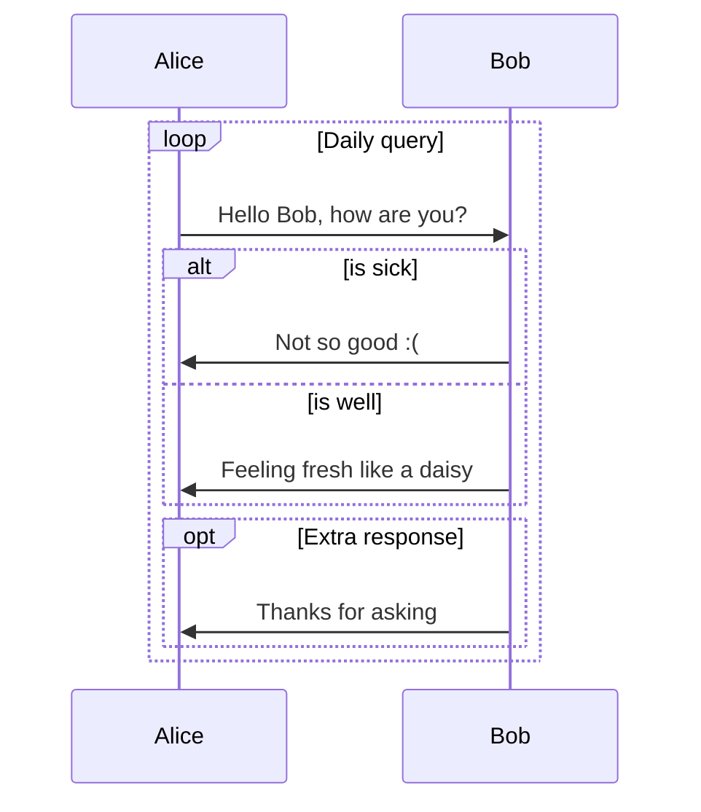

GANTT diagram:

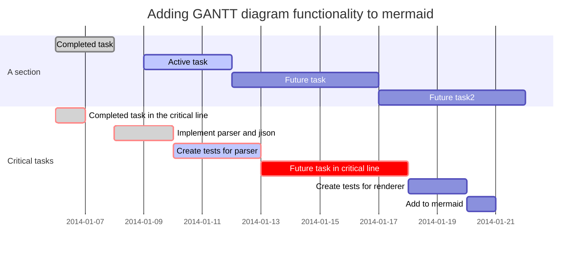

---

💡 edit this Note to see the syntax <br/>
💡 if math expressions are **not** rendered, then you must **enable** them using menu `Mind/Adapt/Markdown`
#### Comments <!-- Metadata: type: Note; created: 2018-05-04 06:48:59; reads: 40; read: 2018-07-10 07:35:46; revision: 10; modified: 2018-07-10 07:35:46; -->
If you want **line** or **multi-line** comment that 
is strictly for yourself (readers of the converted 
document should not be able 
to see it, even with "view source") you could (ab)use 
the link labels (for use with reference style links) 
that are available in the core Markdown specification.

**Single line comment**:

[comment]: # (This is a comment, you cannot see it)

**Multi-line comment**:

[comment]: # (This is a comment)
[comment]: # (that spans multiple lines)
[comment]: # (and you cannot see it)

Note that two conditions are **important**:

* Using `#` (and not other delimiter allowed by Markdown specification)
* An empty line before the comment. Empty line after the comment has no impact on the result.

---

If you need **inline** comment, then use HTML comments:

* There is <!-- secret --> you cannot see.

---

💡 edit this Note to see the syntax
#### Drag & Drop Images and Files <!-- Metadata: type: Note; tags: todo; created: 2018-05-25 07:19:26; reads: 32; read: 2018-07-10 08:11:24; revision: 4; modified: 2018-07-10 08:11:24; -->
_This feature is being implemented._
### Custom HTML Preview CSS <!-- Metadata: type: Note; created: 2018-07-10 08:40:23; reads: 22; read: 2018-07-10 08:46:57; revision: 11; modified: 2018-07-10 08:46:57; -->
If you want to change color, font size, rendering of HTML preview, then it can
be done using **custom CSS**.

You can either use your custom CSS - there is no UI for such change:

1. make sure MindForger is not running
1. download CSS you like https://github.com/dvorka/mindforger/tree/master/app/resources/qt/css (dark or light and choose `Raw`)
2. edit downloaded CSS file and change font size, ...
3. open `$HOME/.mindforger.md` and **change** path to your CSS, e.g.

```
...
* Markdown CSS theme: /home/USERNAME/my.css
...
```

This will ensure that CSS from given path will be loaded by HTML preview since the next time MindForger is started.
## Markdown IDE <!-- Metadata: type: Note; created: 2018-04-10 10:52:12; reads: 50; read: 2018-07-10 07:36:08; revision: 6; modified: 2018-07-10 07:36:08; -->
MindForger is more than just Markdown editor - it is integrated development environment (**IDE**) 
for the development of Markdown document collections (repositories, documentation, books, etc.):

* **multiple** Markdown documents can be opened in order to perform search, refactoring
  and analytics
* user defined **stencils** can be used to quickly create new notebooks and notes
* notebook **structure** can be easily refactored with outliner-style operations
  defined on notes
* both notebooks and notes can be **refactoried** withing or across different notebooks and notes
### Multiple documents <!-- Metadata: type: Note; created: 2018-04-24 14:01:18; reads: 51; read: 2018-07-10 08:11:10; revision: 11; modified: 2018-07-10 08:11:10; -->
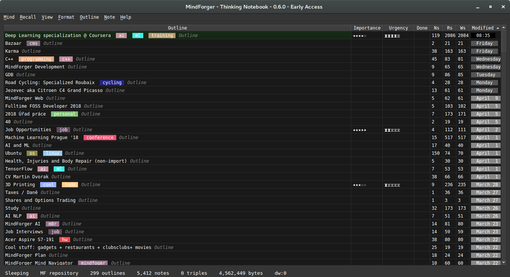

You can open **any** directory and MindForger will find
all Markdown files within that directory and all its 
sub-directories and make them available for search, navigation 
and editation:

```
$ mindforger a-github-repository-with-interesting-content
```

Where `a-github-repository-with-interesting-content` is a directory
containing Markdown documents.

---

💡 if you openeded more than one MindForger document, you can see all documents indexed by MindForger by clicking menu `View/Notebooks`
### Stencils <!-- Metadata: type: Note; created: 2018-04-24 14:01:55; reads: 40; read: 2018-07-10 07:47:00; revision: 23; modified: 2018-07-10 07:47:00; -->
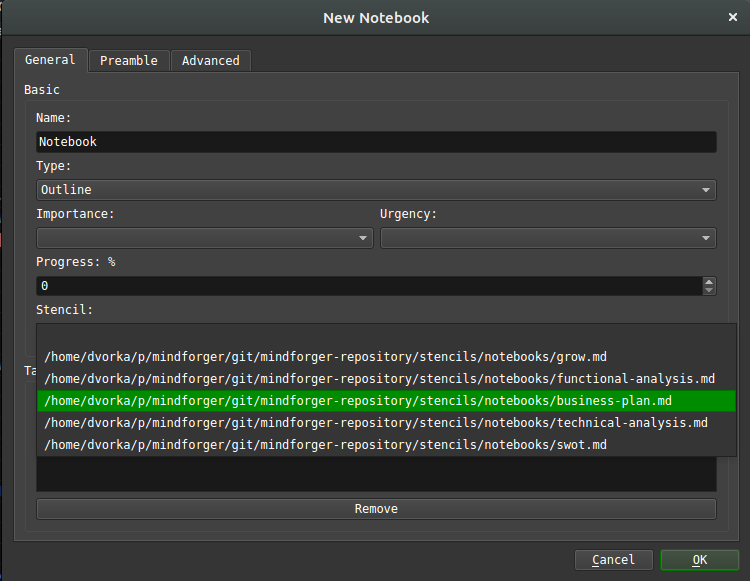

Stencil represents a common pattern that can be used in
various situations e.g. to solve a task. It might be a how to 
(like how to change a car wheel) that **once created**, you 
may want to use **repeatedly** w/ possibility of customization.

Notebook stencil corresponds to application of 
a problem/semantic domain to another problem. 
Once you have a _modus operandi_ or you know how to 
do that, than this is the case.

You can use a stencil when creating a **new** notebook
or note - check `Stencils` drop-down in the dialog
opened using menu `Notebook/New` or `Note/New`.

[MindForger repositories](#mindforger-repository) (including 
the default one) contain stencils for both notebooks and notes:

```
<mindforger repository>/
├── ...
└── stencils
    ├── notebooks
    └── notes
```

MindForger is shipped with an initial set of stencils for meeting
notes, software analysis/design, [GROW model](https://en.wikipedia.org/wiki/GROW_model)
etc. 

You can easily **extend** outlines just by copying Markdown file
to `stencils/notes` or `stencils/notebooks` directory.
### Notebook structure refactoring <!-- Metadata: type: Note; created: 2018-04-10 10:52:55; reads: 53; read: 2018-07-10 07:56:17; revision: 11; modified: 2018-07-10 07:56:17; -->
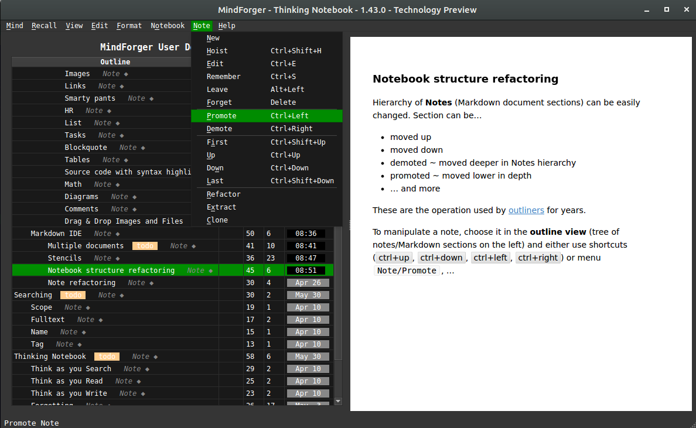

Hierarchy of **Notes** (Markdown document sections) can be easily
changed using operations introduced by [outliners](https://en.wikipedia.org/wiki/Outliner).
**Note** can be...

* moved up
* moved down
* demoted ~ moved deeper in Notes hierarchy
* promoted ~ moved lower in depth
* ... and more

To manipulate a note, choose it in the **outline view** (tree of notes/Markdown sections 
on the left) and either use shortcuts (<kbd>ctrl+up</kbd>, <kbd>ctrl+down</kbd>, 
<kbd>ctrl+left</kbd>, <kbd>ctrl+right</kbd>) or menu `Note/Promote`, ...
### Note refactoring <!-- Metadata: type: Note; created: 2018-04-10 10:52:22; reads: 37; read: 2018-07-10 07:59:07; revision: 5; modified: 2018-07-10 07:59:07; -->
Note (Markdown section) can be refactoring (along with its child notes)
between different Notebooks (Markdown documents):

* choose **source** note to be refactored in the outliner tree of notes
* use menu `Note/Refactor` to specify **target** notebook

Note and its child notes will be moved to the target notebook.
# Searching <!-- Metadata: type: Note; created: 2018-04-10 10:55:15; reads: 49; read: 2018-07-10 08:06:45; revision: 6; modified: 2018-07-10 08:06:45; -->
Ability to find a specific Notebook or Note is one of the 
most important MindForger features. Notebooks and Notes
can be found by:

* full-text search (content)
* name
* tag(s)

---

💡 see menu `Recall` for search options
## Fulltext <!-- Metadata: type: Note; created: 2018-04-10 10:55:44; reads: 42; read: 2018-07-10 09:17:12; revision: 7; modified: 2018-07-10 09:17:12; -->
Use menu `Recall/Full-text Search` to search for **notes**
using full-text search. Result shows notes Markdown source
with **highlighted** matches.

Search **scope**:

* If you run full-text search from notebooks
  view (menu `View/Notebooks`), then **all** notebooks and their
  notes are searched.
* If you run full-text search when a notebook is opened
  (notes outline on the left, note view/editor on the right),
  then **only** notes of that particular notebook are searched.
## Name <!-- Metadata: type: Note; created: 2018-04-10 10:55:57; reads: 32; read: 2018-07-10 09:17:26; revision: 6; modified: 2018-07-10 09:17:26; -->
Use menu `Recall/Recall Notebook by Name` / `Recall/Recall Note by Name`
to search for **notebooks** / **notes** by name. Result shows as you
write the name in the dialog.

Search **scope**:

* If you run note search **by name** from notebooks
  view (menu `View/Notebooks`), then **all** notebooks notes
  are searched.
* If you run note search **by name** when a notebook is opened
  (notes outline on the left, note view/editor on the right),
  then **only** notes of that particular notebook are searched.
## Tag <!-- Metadata: type: Note; created: 2018-04-10 10:56:02; reads: 28; read: 2018-07-10 09:18:55; revision: 4; modified: 2018-07-10 09:18:55; -->
Use menu `Recall/Recall Notebook by Tag` / `Recall/Recall Note by Tag`
to search for **notebooks** / **notes** by tag(s). Result shows as you
add/remove tags in the dialog.

Search **scope**:

* If you run note search **by tag** from notebooks
  view (menu `View/Notebooks`), then **all** notebooks notes
  are searched.
* If you run note search **by tag** when a notebook is opened
  (notes outline on the left, note view/editor on the right),
  then **only** notes of that particular notebook are searched.
## Named-entity Recognition <!-- Metadata: type: Note; tags: todo,wip; created: 2018-07-10 08:04:50; reads: 28; read: 2018-07-10 08:11:31; revision: 5; modified: 2018-07-10 08:11:31; -->


_This feature is being implemented._
## Semantic Domain <!-- Metadata: type: Note; tags: todo; created: 2018-07-10 08:04:26; reads: 23; read: 2018-07-10 09:53:59; revision: 7; modified: 2018-07-10 09:53:59; -->
_This feature is being implemented._
# Thinking Notebook <!-- Metadata: type: Note; created: 2018-04-10 10:50:28; reads: 75; read: 2018-07-10 09:37:44; revision: 9; modified: 2018-07-10 09:37:44; -->
MindForger aims to mimic human mind - **learning**, **recalling**, 
**recognition**, **associations**, **forgetting** - in order to achieve 
synergy with your mind to make your searching, reading and writing more 
productive:

* **learning**: MindForger loads Markdown document(s), parses them and construct [knowledge graph](#knowledge-graph-navigator) 
* **recalling**: you can recall notebooks/notes by content, name, tags, semantic domain, ...
* **recognition**: MindForger is able to recognize people, organization, places, ... in your remarks
* **associations**: MindForger suggests relevant notes as you browse, read and edit notebooks and notes
* **forgetting**: MindForger handles the process of scoping and forgetting analogous to human mind
## Thinking vs Sleeping mode <!-- Metadata: type: Note; tags: important; created: 2018-07-10 08:12:30; reads: 21; read: 2018-07-10 09:44:42; revision: 8; modified: 2018-07-10 09:44:42; -->
MindForger can be either in **thinking** or **sleeping** mode:

* **Thinking** mode can be activated from menu `Mind/Think` and it's also
  indicated by the `Thinking` indicator in main window status bar.
    * MindForger runs background mind-related computations/tasks that can be **CPU intensive**
    * MindForger suggests relevant notes as you browse/read/write
    * MindForger named-entity recognition model is loaded and enabled
    * ...
* **Sleeping** mode can be activated from menu `Mind/Sleep` and it's also
  indicated by the `Sleeping` indicator in main window status bar.
    * MindForger runs **no** background mind-related computations/tasks i.e. it 
      does **not** consume any extra CPU power and does **not** show any async information

Switch thinking/sleeping mode based on whether you **need** mind features for the particular
repository or not - consider performance/CPU consumption vs features trade-off.
## Think as you Search <!-- Metadata: type: Note; tags: todo; created: 2018-04-10 10:49:58; reads: 52; read: 2018-07-10 08:11:44; revision: 4; modified: 2018-07-10 08:11:44; -->
_This feature is being implemented._
## Think as you Read <!-- Metadata: type: Note; created: 2018-04-10 10:50:11; reads: 49; read: 2018-07-10 09:50:47; revision: 12; modified: 2018-07-10 09:50:47; -->
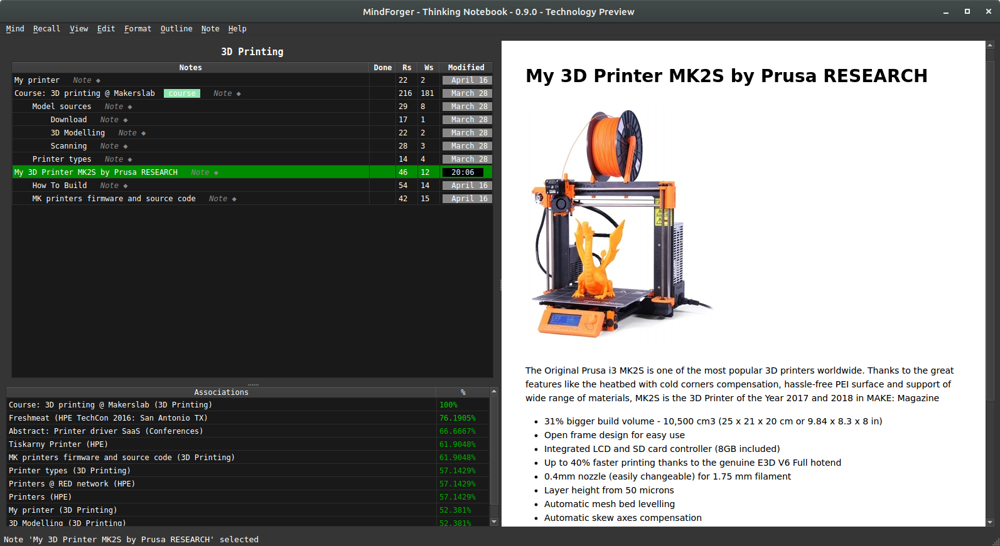

MindForger is able to **suggest relevant notes** as you browse and
read:

* relevant notes are computed for the note being currently **selected**
* relevant notes are shown in the **lower left corner** by `Associations` table
* similarity score in the `Associations` table indicates **relative relevancy** in %


In the screenshot above you can see relevant notes (lower left corner) for the selected
note `My 3D Printer MK2S by Prusa RESEARCH`.
## Think as you Write <!-- Metadata: type: Note; created: 2018-04-10 10:50:18; reads: 49; read: 2018-07-10 09:53:28; revision: 10; modified: 2018-07-10 09:53:28; -->


MindForger is able to **suggest relevant notes** as you write note
content in the editor:


* relevant notes are computed for the **word under the cursor**
* relevant notes are shown in the **lower left corner** by `Associations` table
* similarity score in the `Associations` table indicates **relative relevancy** in %


In the screenshot above you can see relevant notes (lower left corner) for the selected
word `graph` (notice cursor between letter `g` and `r` on the current line with light-gray background).
## Knowledge Graph Navigator <!-- Metadata: type: Note; tags: todo,wip; created: 2018-07-10 08:13:17; reads: 36; read: 2018-07-10 12:56:24; revision: 4; modified: 2018-07-10 12:56:24; -->
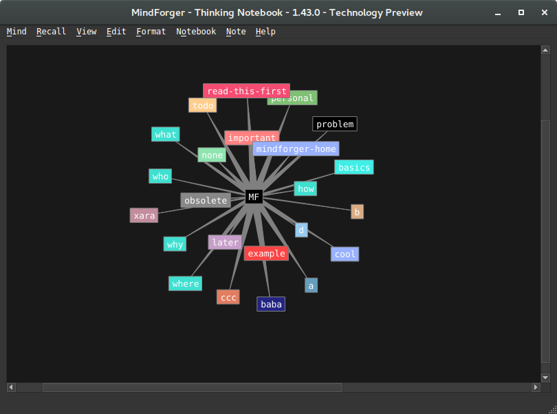

_This feature is being implemented._
## Forgetting <!-- Metadata: type: Note; created: 2018-04-10 10:54:02; reads: 32; read: 2018-05-03 09:26:24; revision: 17; modified: 2018-05-03 09:26:24; -->
> Motto: "Computers need to forget". -- [Viktor Mayer-Schönberger](http://blog.mindforger.com/2007/11/computers-need-to-forget.html)

Before I deep dive to MindForger features let me formulate
a few questions to explain the motivation behind 
forgetting/scoping related functionality:

* Do we forget or we simply don’t remember?
* When we forget?
* How and where exactly forgetting in our minds happens?
* If we remember something, can it be forgotten?
* Do we need to forget and why?

I believe that if a concept makes it to long term memory
(LTM), then it can be never forgotten. It’s in LTM and 
it always be there. The only question is how many 
association/links it has. In the worst case it may happen 
that there is no association path it it - it ends as an
island or orphan better said. If it’s not reminded or not 
used for long time, association can get weaker and weaker 
and such concepts is diving deeper and deeper to LTM. However,
it is always there. Thus it’s just about the lookup. 
According to my experience a strong emotional experience or 
return to the deeper paths of LTM (talking about your friends 
or family about your early childhood) helps to remind such
concepts and in the latter case even strongly bind them 
to upper level LTM (move them up in the memory) and 
refresh such memories so that you can remind them later 
much more easier.

If there would be no possibility of the selection of sensed
informations and all the sensing will be fixed in our 
memory, its capacity would be fully used very soon.

MindForger, as computer program, needs to forget. But
forgetting does **NOT** mean deleting of information.

MindForger maintains **all** the remarks you ever written
(see [limbo](#limbo)), but works with/shows only with 
a [scope](#time-scope) **configurable** by you.
### Time Scope <!-- Metadata: type: Note; created: 2018-04-10 10:54:24; reads: 69; read: 2018-07-11 16:28:46; revision: 47; modified: 2018-07-11 16:28:46; -->
Use menu `Mind/Scope` or <kbd>Alt+m c</kbd> to configure **time** scope.

---

Consider the following situations:

* Over the years your employer company internal systems change and/or
  you work for a number of different employers. Each time there is 
  a different/better/stronger 
  Wifi authentication configuration (video conference
  setup, payslips system, etc.). Therefore in you memory (or in MindForger
  remarks) there are **multiple** how-tos, but you want to use
  only the **recent** want. At the same time you do not want to
  (explicitly) remove/purge the previous how-tos as they can be useful in different
  situations.

* You learn how to manually divide two long numbers as a child.
  Then you do **not** need this skill **for years** as you use calculator/computer.
  When you want to learn your child how to manually divide numbers,
  you have to find it (deep) in your memory.

This is where MindForger **time scope** functionality comes in - you can 
restrict the scope (notes working set) by **time**. For example:

* you work on a project and want to see only notes you modified **today**
* whenever you use MindForger you want to work with notes not older
  than **18 months**
* when reading/working with your employer internal systems how-to **notebook** you want to
  see only notes younger than **1 year**

In particular you can set **global** time scope:

* Notebooks listing: 
    * Only **noteboks** within given time scope (younger) will be shown.
* Add/forget notebook:
    * Notebooks can be added/forgotten.
* Notebook's note tree view: 
    * Only notes within given time scope will be shown.
      If note **is** within timescope and note's parent notes are **not**, then note **is**
      shown along with its parents (parents would be normally hidden). In other words, fresh note
      ensures its parents are shown.
* Add/remove note: 
    * Notes can be added/forgotten.
    * **IMPORTANT**: remember that note can be forgotten **along with its child notes** that can be
      hidden (if they didn't match time scope) i.e. you may delete notes you don't see.
* Promote/demote/up/down note:
    * Notes can be added/forgotten.
    * **IMPORTANT**: remember that these operations work on the **non-filtered* model i.e.
      you perform operation (e.g. up), nothing seems to happen, but the note was just moved above
      a hiddin note that is not in scope i.e. you refactor notes you don't see.
* Note refactoring:
    * Notes can be refactoring (to other notebook) and extracted.
    * **IMPORTANT**: remember that note can be refactored **along with its child notes** that can be
      hidden (if they didn't match time scope) i.e. you may move notes you don't see.
     
In particular you can set **note** specific time scope that overrides global time scope:

* ... behaviour is the same as above except that this setting has no effect on notebooks listing ...
### Tag Scope <!-- Metadata: type: Note; created: 2018-07-10 08:07:12; reads: 20; read: 2018-07-11 16:28:38; revision: 6; modified: 2018-07-11 16:28:38; -->
Use menu `Mind/Scope` or <kbd>Alt+m c</kbd> to configure **tag(s)** scope.

---

Scoping using **tag(s)** allows you to limit notebook **working set** only
to notebooks having specified set of tags. It's useful when you work with
bigger MindForger repositoriers and you don't want to be distracted by
unrelated notebooks.

Scoping using tags can be combined (`AND`) with [scoping using time](#time-scope).
### Limbo <!-- Metadata: type: Note; created: 2018-04-10 10:56:16; reads: 24; read: 2018-05-03 10:06:46; revision: 4; modified: 2018-05-03 10:06:46; -->
MindForger does **not** **delete** notebooks - it moves them to a location called Limbo that
can be found in `${ACTIVE_MF_REPOSITORY}/limbo`. This is where you can delete Markdown
documents pernamently.

MindForger, in its current implementation, **does** delete notes. They are not moved to a note Limbo.
If you use menu `Note/Forget`, then the note is deleted. 

Side note: I personally use CMS (Git) - I have full history of notebooks and notes. Tracking of
all notes would be usefull, however HW resource consumption intensive. This is also
why I don't want to duplicate this (already sophisticated) functionality within MindForger.
# Productivity <!-- Metadata: type: Note; created: 2018-07-10 08:17:32; reads: 17; read: 2018-07-10 08:39:47; revision: 6; modified: 2018-07-10 08:39:47; -->
MindForger aims to help you when you study, write a document/paper/article/book or
want to achieve a goal.

Therefore it enables you to...

* prioritize work on notebooks using **urgency** and **importance**
* helps you to decide what you do first and next using **Eisenhower matrix**
* track **progress** in %
* specify **deadlines** (for notes)
## Urgency and Importance <!-- Metadata: type: Note; created: 2018-07-10 08:20:52; reads: 18; read: 2018-07-10 08:30:44; revision: 7; modified: 2018-07-10 08:30:44; -->
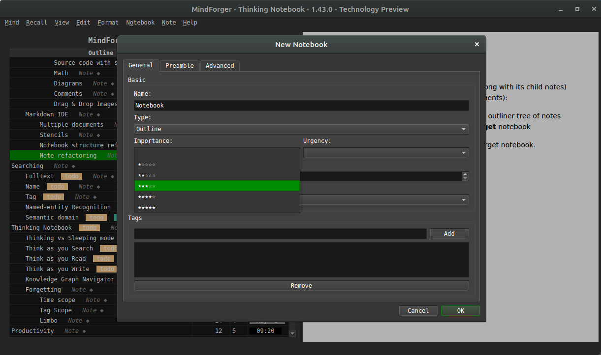

When creating (menu `Notebook/New`) or editing **notebook** (edit mode `More...` button) you
can specify:

* **importance** property ~ how important is the notebook
* **urgency** property ~ how important is (study/challenge/...) task related to notebook (or notebook content itself)

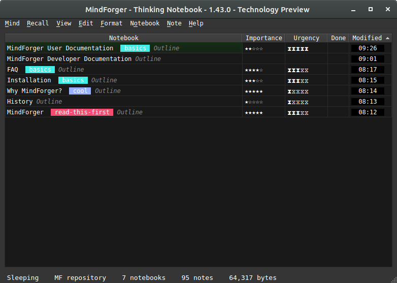

These properties are in turn shown in **notebooks view** (menu `View/Notebooks`) and [Eisenhower matrix](#eisenhower-matrix).
## Eisenhower Matrix <!-- Metadata: type: Note; created: 2018-07-10 08:21:01; reads: 27; read: 2018-07-10 08:38:33; revision: 10; modified: 2018-07-10 08:38:33; -->
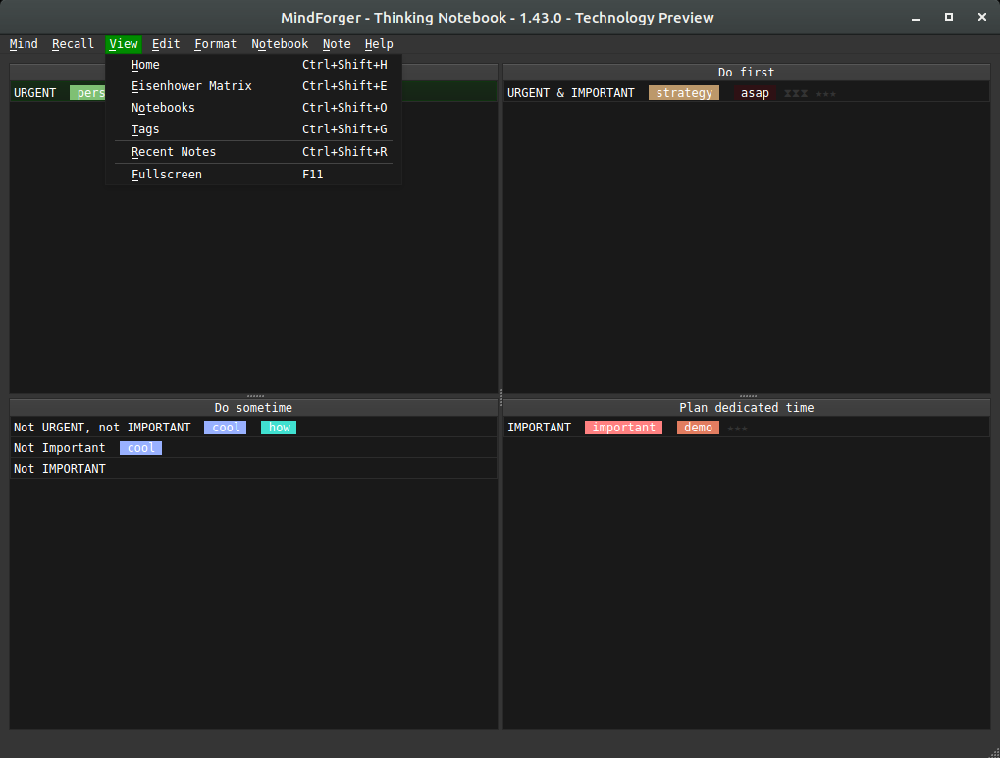


**Wikipedia**: [Eisenhower matrix](https://en.wikipedia.org/wiki/Time_management#The_Eisenhower_Method) stems from a quote attributed to Dwight D. Eisenhower: "I have two kinds of problems, the urgent and the important. The urgent are not important, and the important are never urgent."

Using the Eisenhower Decision Principle, tasks are evaluated using the criteria [important/unimportant](#urgency-and-importance) and [urgent/not urgent](#urgency-and-importance), and then placed in according quadrants in an **Eisenhower Matrix** (also known as an "Eisenhower Box" or "Eisenhower Decision Matrix"). Tasks are then handled as follows:

Tasks in

1. **Important/Urgent quadrant** are done immediately and personally e.g. crises, deadlines, problems.
1. **Important/Not Urgent quadrant** get an end date and are done personally e.g. relationships, planning, recreation.
1. **Unimportant/Urgent quadrant** are delegated e.g. interruptions, meetings, activities.
1. **Unimportant/Not Urgent quadrant** are dropped e.g. time wasters, pleasant activities, trivia.

This method is said to have been used by U.S. President Dwight D. Eisenhower.
# Cheatsheets <!-- Metadata: type: Note; created: 2018-04-10 10:53:18; reads: 19; read: 2018-06-09 23:10:38; revision: 2; modified: 2018-06-09 23:10:38; -->
See MindForger cheetsheet(s):

* [Keyboard Shortcuts](#keyboard-shortcuts)
## Keyboard Shortcuts <!-- Metadata: type: Note; created: 2018-03-17 17:50:10; reads: 40; read: 2018-07-10 08:00:10; revision: 13; modified: 2018-07-10 08:00:10; -->
Prefer menu based keyboard shortcuts which are self-documented e.g.

* <kbd>Alt+o n</kbd>       
    * create new notebook
* <kbd>Alt+o e</kbd>       
    * edit currently viewed notebook
* <kbd>Alt+n n</kbd>       
    * create new note
* <kbd>Alt+n e</kbd>       
    * edit currently viewed note
* ... and many others...


Editor:

* <kbd>Alt+Left</kbd>
    * ... save Note, leave editor and show rendered HTML.
* <kbd>Ctrl+g</kbd>
    * ... cancel editation and leave editor without saving

Views:

* <kbd>Ctrl+Shift+o</kbd>
    * ... recall n**o**tebook.
* <kbd>Ctrl+Shift+n</kbd> 
    * ... recall **n**ote.
